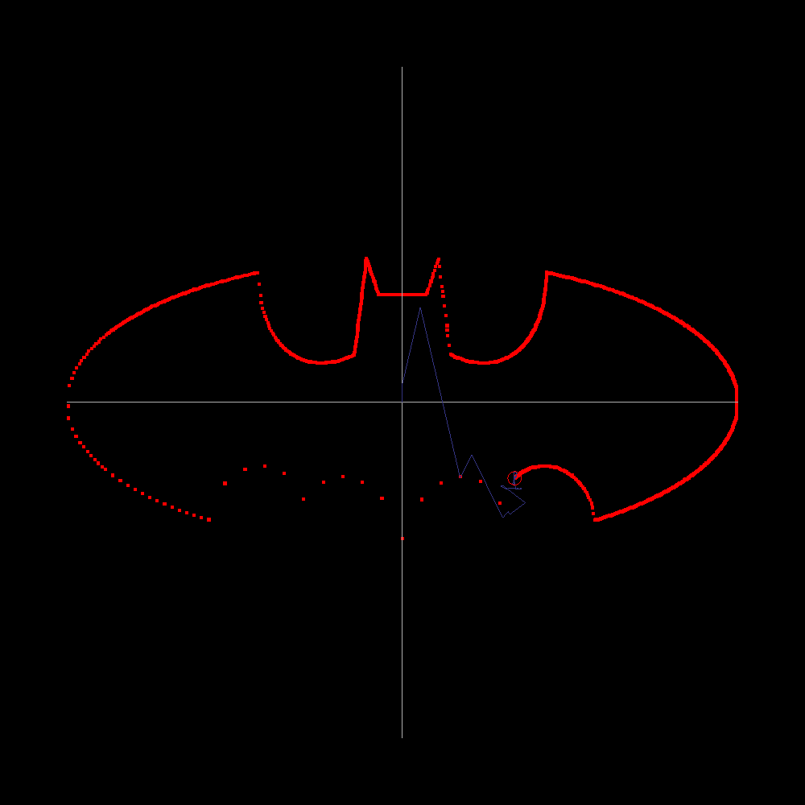

# **Example of 2D Complex fourier transforms.**



# Running

Required `SDL2` and `gcc`.

```bash
make run
```

# Controls

* z: toggle zoom to the cursor
* f/s: faster/slower (larger/smaller step size)
* plus/minus (Numpad): increase/decrease number of rendered coefficients (initially set to max = 10000)
* mul/div (Numpad): double/halve the number of rendered coefficients (initially set to max = 10000)

## Author

Alexander Dmitriev

Feel free to contact me about bugs or suggestions :)
